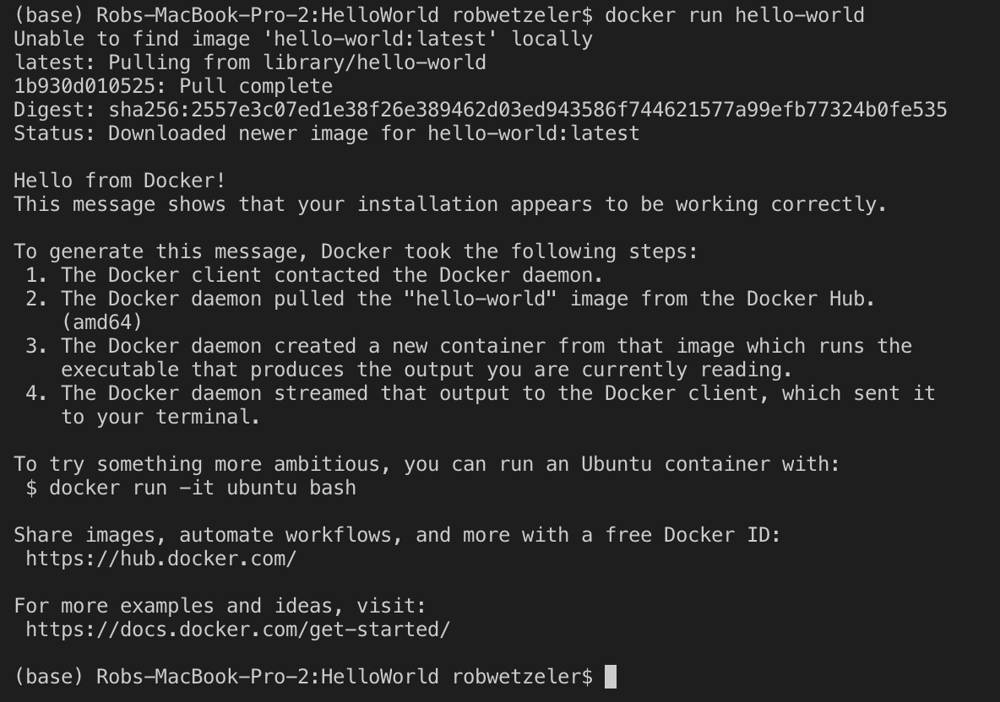

# Hello World of Containers - Meetup Edition

Run your first image!

```bash
docker run hello-world

Unable to find image 'hello-world:latest' locally
latest: Pulling from library/hello-world
ca4f61b1923c: Pull complete
Digest: sha256:ca0eeb6fb05351dfc8759c20733c91def84cb8007aa89a5bf606bc8b315b9fc7
Status: Downloaded newer image for hello-world:latest

Hello from Docker!
This message shows that your installation appears to be working correctly
```
